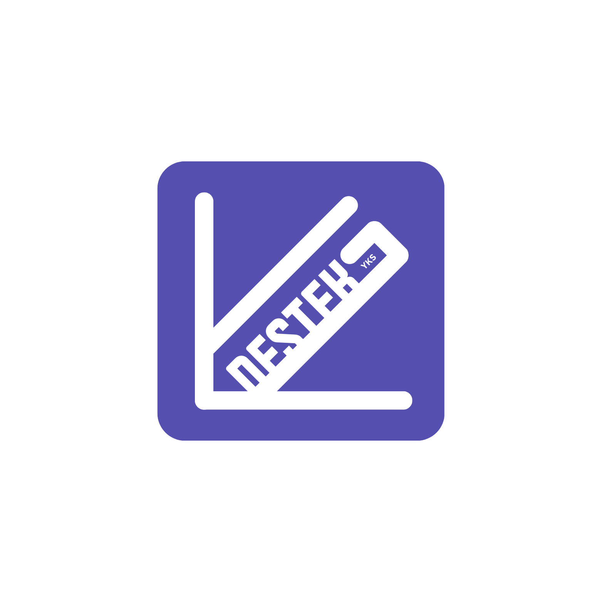
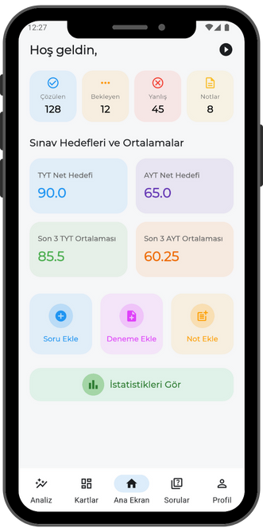
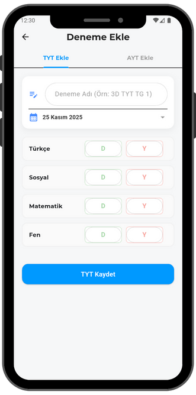
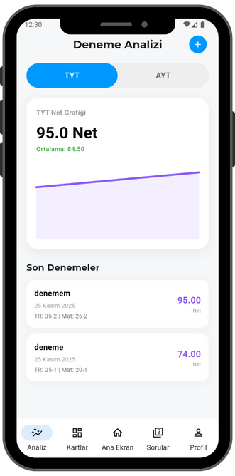
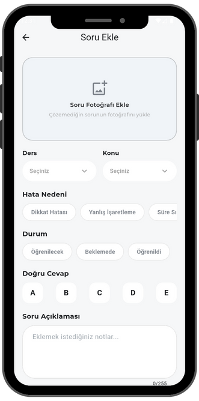
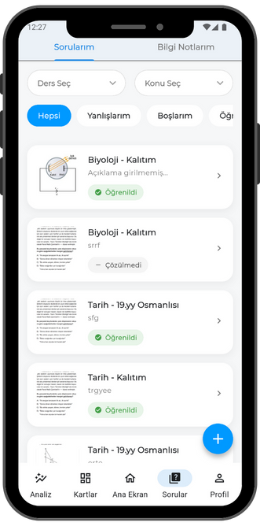

# 🚀 Anliyo - Akıllı YKS & LGS Hazırlık Asistanı

 

**Anliyo**, öğrencilerin sınav hazırlık süreçlerini (YKS, TYT, AYT, LGS) verimli bir şekilde yönetmelerini sağlayan, deneme analizleri ve grafiksel gelişim takibi sunan kapsamlı bir mobil uygulamadır.

---

## 📱 Ekran Görüntüleri

| Giriş Ekranı | Ana Sayfa | Deneme Ekleme | Grafik Analizi |
|:---:|:---:|:---:|:---:|
|  |  |  |  |  |  |

---

## ✨ Özellikler

### 🔐 Güvenli Giriş & Kayıt
* **Çoklu Giriş Yöntemi:** E-posta/Şifre, **Google ile Giriş** ve **Apple ile Giriş (Sign in with Apple)** desteği.
* **Onboarding (Karşılama):** Kullanıcıyı tanıyan anketler (Alan seçimi, hedef belirleme).

### 📊 Deneme Takibi ve Analiz
* **Detaylı Kayıt:** TYT ve AYT denemelerini ders bazında (Doğru/Yanlış) kaydetme.
* **Net Hesaplama:** ÖSYM katsayılarına uygun otomatik net hesaplama.
* **Grafiksel Gelişim:** `fl_chart` ile ders bazlı net değişim grafikleri.
    * *Genel Bakış, Matematik, Fen, Türkçe/Sosyal ayrı grafikler.*
    * *Maksimum Net ve Ortalama Net göstergeleri.*

### 🎯 Kişiselleştirilmiş Deneyim
* **Alan Bazlı Filtreleme:** Sayısal, Eşit Ağırlık, Sözel ve Dil öğrencileri için sadece ilgili derslerin gösterimi.
* **Hedef Takibi:** Öğrencinin hedeflediği üniversite/bölüm odaklı ilerleme.

### 🛠 Diğer Özellikler
* **Bilgi Notları:** Derslere özel pratik notlar ekleme ve kaydetme.
* **Geri Sayım:** Sınava kalan süreyi gösteren sayaç.
* **Karanlık Mod (Dark Mode):** Göz yormayan tema desteği.

---

## 🛠 Kullanılan Teknolojiler

Bu proje **Flutter** ile geliştirilmiş olup, aşağıdaki kütüphane ve mimarileri kullanmaktadır:

* **State Management:** `flutter_riverpod` (Modern ve güvenli durum yönetimi).
* **Backend & Auth:** `firebase_auth`, `cloud_firestore` (Veri saklama ve kimlik doğrulama).
* **Routing:** `go_router` (Sayfalar arası gezinme).
* **UI/UX:** `google_fonts`, `gap`, `cupertino_icons`.
* **Grafikler:** `fl_chart` (Deneme analizleri için).
* **Yerel Depolama:** `shared_preferences` (Basit ayarlar ve onboarding durumu için).
* **Tarih İşlemleri:** `intl`, `timeago`.

---

## 📩 İletişim

Geliştirici: **[Kaan GÜL]**
E-posta: [kaan.gul.developer@gmail.com]
LinkedIn: [[Profil Linkiniz](https://www.linkedin.com/in/gkaan/)]

---
© 2024 Anliyo. Tüm hakları saklıdır.